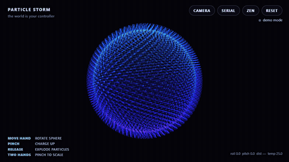

# Particle Storm

**NYTechWeek Hardware Hack — "The world is your controller."**

An STM32 sensor board becomes a physical motion remote that drives a 3D storm of
particles in the browser — tilt to orbit, hold a hand over the sensor to gather, shake to
explode. A live webcam + hand-tracking mode and a LAN multiplayer mode let anyone join,
and a generative lofi/zen soundscape reacts to every move.



## Hardware

- STM32 Nucleo-G474RE (Cortex-M4 @ 170 MHz)
- MPU-6050 accelerometer + gyroscope (tilt / shake)
- HC-SR04 ultrasonic distance sensor (hand distance)
- MCP9808 temperature sensor (particle hue)
- Adafruit STEMMA speaker (zen tones)

## Three ways to control it

| Mode | Input |
|------|-------|
| **Serial** | the STM32 board over USB (Web Serial) — tilt, hand-distance, shake, temp |
| **Camera** | webcam + MediaPipe hand tracking — move / pinch / release / two hands |
| **Multiplayer** | others scan a QR, bring their own board (or phone motion), and join the same screen over LAN |

Every explosion — from any controller, local or remote — rings a pentatonic bell, so the
room plays the soundscape in harmony. The STEMMA speaker plays its own zen tones too.

## Run

**Firmware**
```
pio run            # build
pio run -t upload  # flash the board
pio device monitor # watch the CSV stream (115200)
```

**Web app + LAN multiplayer**
```
cd server
npm install
npm start          # prints an https:// URL — open it, accept the self-signed cert
```
Open the printed `https://<LAN-IP>:8443/`, then use **Camera**, **Serial**, **Zen**, or
share the on-screen **QR** so others can join. HTTPS is required because Web Serial and the
camera only work in a secure context.

Single-machine demo without the relay:
```
cd web && python -m http.server 8000   # http://localhost:8000/hand-particle-sphere.html
```

## Serial protocol

One CSV line per frame at 115200 baud, `\n`-terminated; lines starting with `#` are logs:
```
roll,pitch,dist,temp,gesture
```
